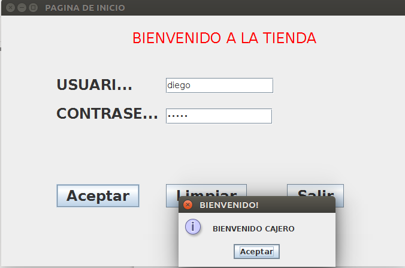
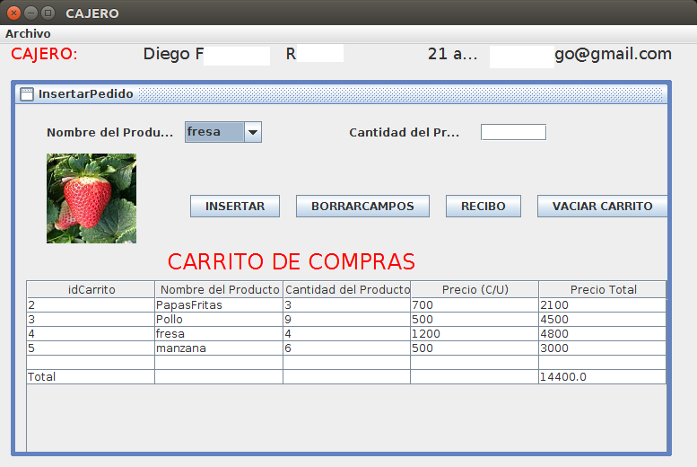
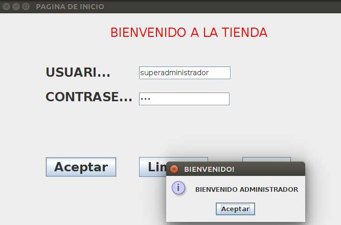
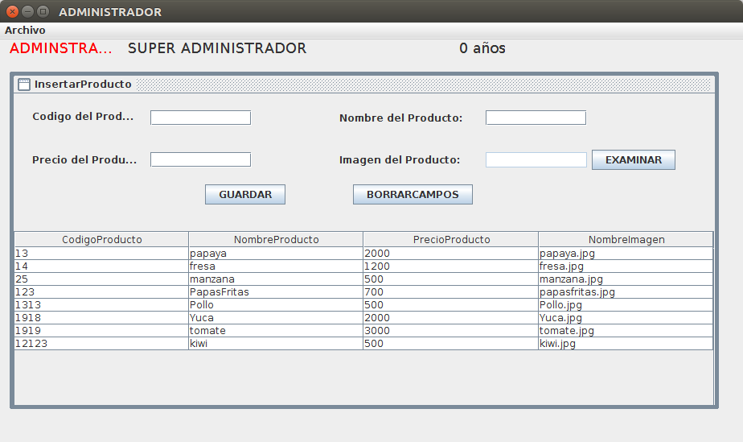
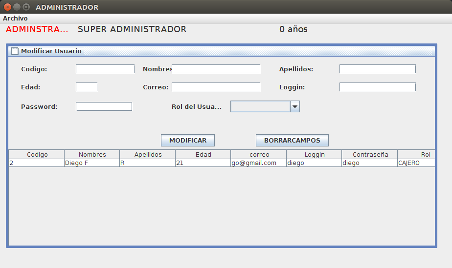

# Tienda
Tienda desarrollada en Java, simulación de una tienda para la venta de productos de la canasta familiar.

## ¿Cómo funciona?

Al iniciar la aplicación se inicia una ventana de login, donde el cajero inicia sesión (imagen 1), en la siguiente imagen (imagen 2) se muestra una ventana "InsetarPedido", donde hay varias opciones: nombre del cajero, edad y correo, además, el nombre del producto, imagen, cantidad y el carrito de compras. Hay varias acciones (botones) como insertar, borrar campos, recibo (JaspertReport) y vaciar carrito. En consecuencia, el menu "Archivo" contiene dos opciones más, "ModificarPedido y EliminarPedido".

Por otro lado al iniciar sesión como administrador (Imagen 3), se muestra una ventana donde se puede "InsertarProducto" con sus atributos (Imagen 4): código, nombre, precio, etc. Además de Elimnar y Modificar Producto.

Agregando, el administrador tiene también la capacidad de editar ("Modificar Usuario) los datos de los usuarios (Imagen 5), cambiar su rol: Cajero o administrador. Además de Eliminar y Insertar Usuarios.

Nota: No olvidar agregar las librerías: mysql-connector-java y Jasper-Report. Y cambiar la configuración de la conexión con la base de datos (conexion.java)
